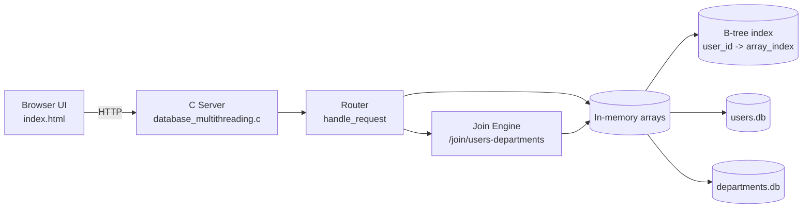
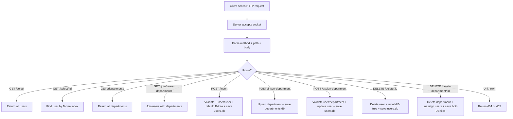
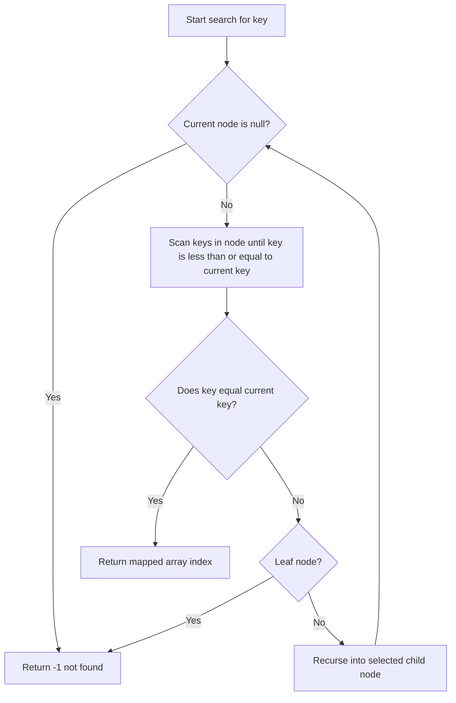
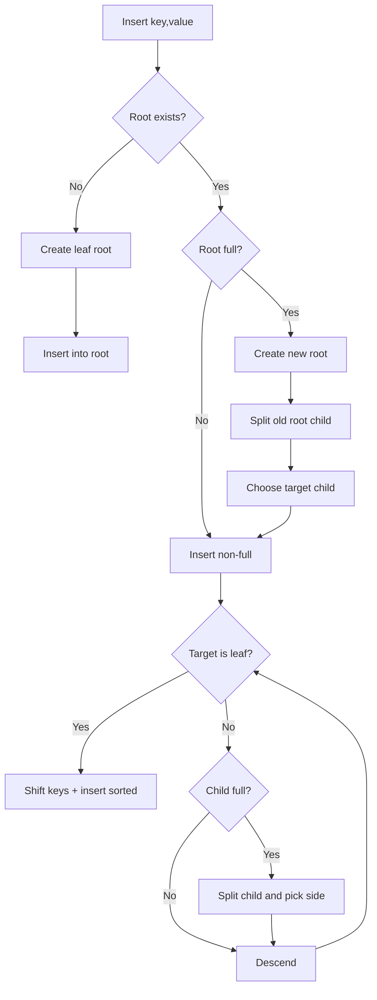
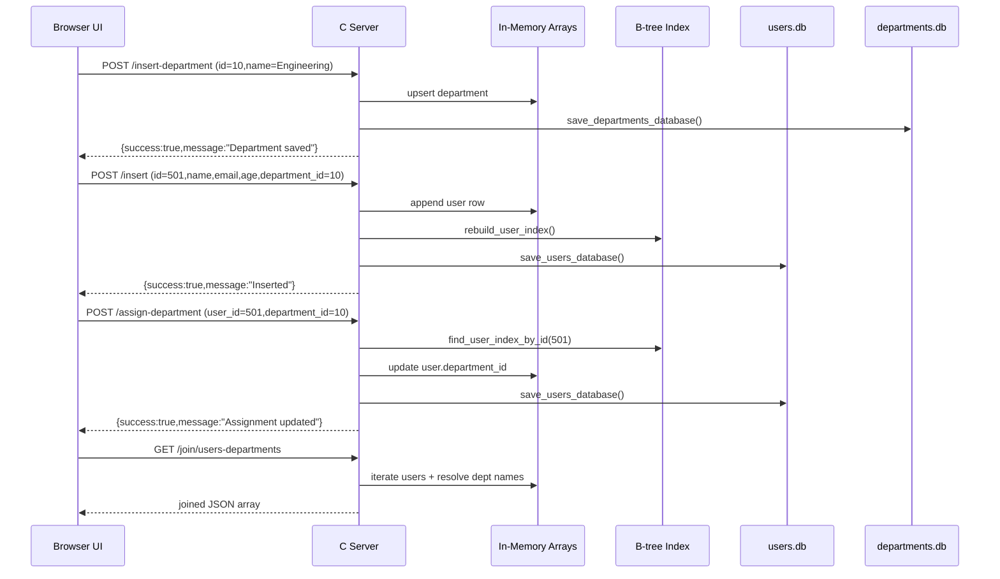

# Database Project (C + HTML)

This project is a lightweight HTTP database service written in C (WinSock) with a browser UI.

It now supports:
- User records
- Department records
- Join between users and departments
- B-tree index on user IDs for fast lookup

## 1. Project Overview

### Core idea
The backend stores two datasets in binary files:
- `users.db`
- `departments.db`

At runtime, data is loaded into in-memory arrays. A B-tree index is built on `user.id` so reads and existence checks are faster than linear scans.

### Main files
- `database_multithreading.c`: HTTP server, persistence, join logic, B-tree index.
- `index.html`: Browser UI for CRUD, department management, assignment, and join view.
- `users.db`: Persisted user table.
- `departments.db`: Persisted department table.

## 2. Architecture Schema



## 3. Request Flowchart



## 4. Join Function Between Files

The join endpoint is:
- `GET /join/users-departments`

How it works:
1. Iterate all users in memory.
2. For each user, read `department_id`.
3. Search department table by `department_id`.
4. Emit combined JSON row:
   - user fields (`id`, `name`, `email`, `age`)
   - department fields (`department_id`, `department_name`)
5. If department is missing, set `department_name` to `UNASSIGNED`.

This is effectively an in-memory join using data loaded from two persisted files.

## 5. B-tree Function (Explained with Flowchart)

The B-tree stores mappings:
- `key = user_id`
- `value = array_index`

So when querying `GET /select/:id`, the server can locate the user index through the tree.

### B-tree Search Flow



### B-tree Insert/Split Flow



## 6. API Reference

### Users
- `GET /select`
- `GET /select/{id}`
- `POST /insert` with form body: `id`, `name`, `email`, `age`, optional `department_id`
- `DELETE /delete/{id}`

### Departments
- `GET /departments`
- `POST /insert-department` with form body: `id`, `name`
- `POST /assign-department` with form body: `user_id`, `department_id`
- `DELETE /delete-department/{id}`

### Join
- `GET /join/users-departments`

## 7. Build and Run (Windows)

Compile:
```bash
gcc -Wall -Wextra -std=c11 -o database_server.exe database_multithreading.c -lws2_32
```

Run server:
```bash
./database_server.exe
```

Open UI:
- Open `index.html` in a browser.
- Use the forms/buttons to test endpoints.

## 8. Notes

- A critical section is used for shared data protection.
- The server currently processes one socket request at a time in the accept loop.
- The B-tree is rebuilt after inserts/deletes to keep index-to-array mappings valid.

## 9. Sequence Diagram (Example Scenario)

Scenario:
1. Create department `Engineering`.
2. Insert user `Test User`.
3. Assign the user to the department.
4. Fetch joined results.



## 10. How To Extend (3rd Table + Multi-Join)

If you want to add a third table (example: `projects`) and join it with users/departments:

### Step 1: Add new table storage
- Add constants and arrays in `database_multithreading.c`:
    - `MAX_PROJECTS`
    - `PROJECTS_DB_FILE`
    - arrays like `project_ids[]`, `project_names[]`, `project_owner_user_id[]`
- Add `project_count`.

### Step 2: Add persistence functions
- Create:
    - `save_projects_database()`
    - `load_projects_database()`
- Call `load_projects_database()` in `main()` startup sequence.

### Step 3: Add lookup/index helpers
- If you query `project_id` frequently, add a B-tree for projects too:
    - `project_index_root`
    - `rebuild_project_index()`
    - `find_project_index_by_id()`
- Keep the same pattern used for users.

### Step 4: Add CRUD endpoints
- Add routes in `handle_request()`:
    - `POST /insert-project`
    - `GET /projects`
    - `DELETE /delete-project/{id}`

### Step 5: Add multi-table join endpoint
- Add endpoint like `GET /join/users-departments-projects`.
- Join logic pattern:
    1. Iterate projects (or users depending on output shape).
    2. Resolve related user using user ID (B-tree recommended).
    3. Resolve user department by `department_id`.
    4. Emit one combined JSON object per output row.

### Step 6: Keep consistency guarantees
- Protect write/update operations with the same critical section.
- Save affected DB files after mutations.
- Rebuild indexes whenever row order changes (insert/delete compaction).

### Suggested join response shape
```json
{
    "project_id": 77,
    "project_name": "Migration",
    "user_id": 501,
    "user_name": "Test User",
    "department_id": 10,
    "department_name": "Engineering"
}
```
